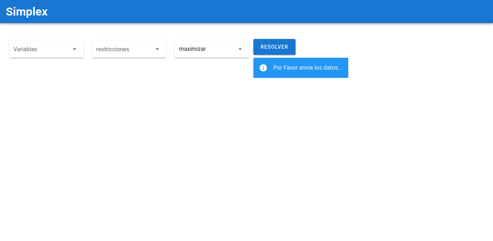
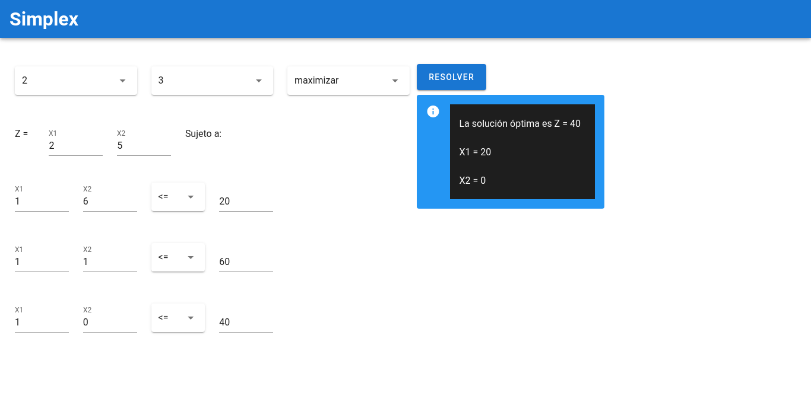
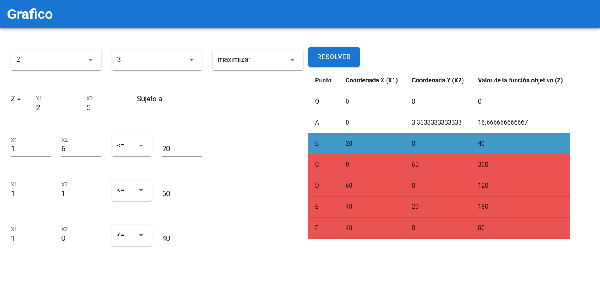

# Simplex Solver

**base repository**: https://github.com/erickjosue8916/simplex-solver.git

> University Project: Resolve problems related to simplex and graphic methods (economy)


# Topics
- Simplex Method (Economy) [Learn More](https://www.plandemejora.com/metodo-simplex-paso-a-paso-ejemplos-maximizar-minimizar/)
- Graphic Method (Economy)
- NodeJs [Lear More](https://nodejs.org/es/)
- VueJs
- Web Scraping
- PHP Simplex (Web Scraped) [Lear More](http://www.phpsimplex.com/simplex/simplex.htm)

# Requirements
- Node Js Installed

# Installation
```bash
  cd /path/to/project
  npm install
```

# Run
```bash
  npm start
```

# Screens
## localhost:5000/simplex



## localhost:5000/graphic
